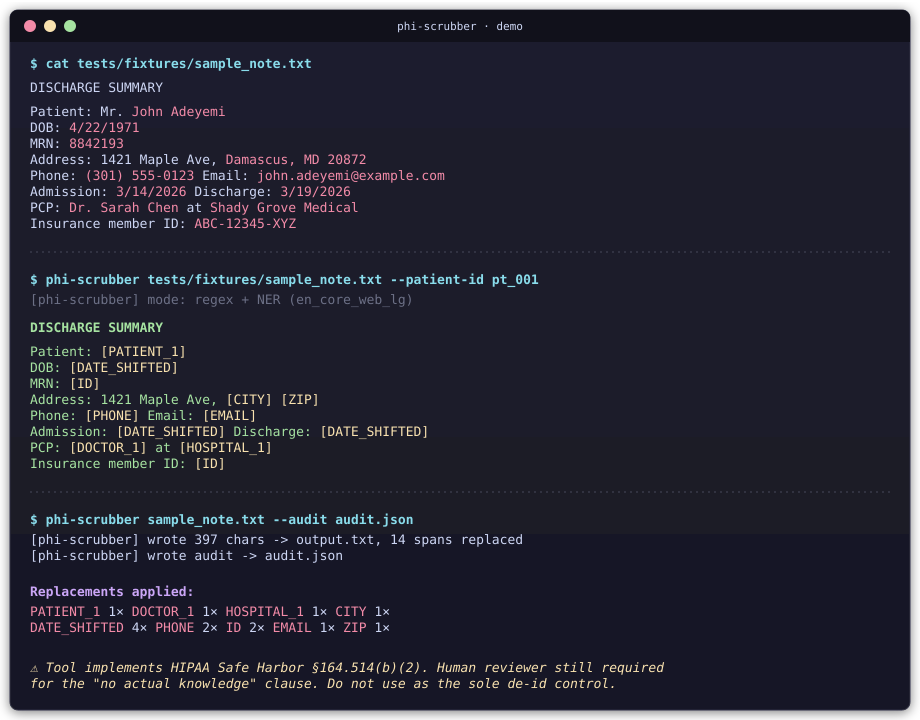
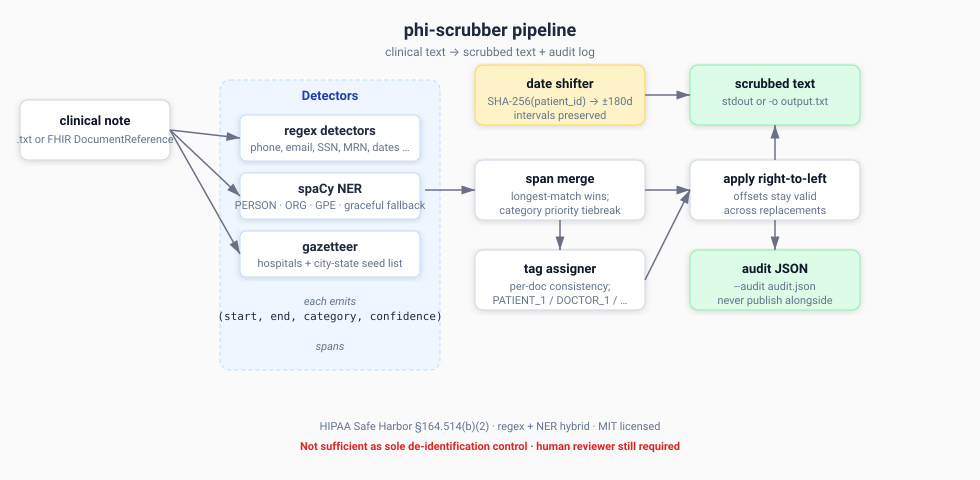

# phi-scrubber

[](https://github.com/PaulAdejayan/phi-scrubber/actions/workflows/ci.yml)
[](LICENSE)
[](https://www.python.org/downloads/)
[](#tests)
[(2)-yellow.svg)](https://www.hhs.gov/hipaa/for-professionals/privacy/special-topics/de-identification/index.html)

Pattern-based + NER-based de-identification of clinical free-text, aligned with **HIPAA Safe Harbor Method (45 CFR §164.514(b)(2))**.

> **⚠️ This tool implements pattern-based + NER-based detection aligned with HIPAA Safe Harbor Method (§164.514(b)(2)). It does NOT satisfy the "no actual knowledge" clause on its own — a qualified human reviewer is still required for formal Safe Harbor compliance. It also does NOT implement the Expert Determination Method. Do not use as the sole de-identification control on real PHI without institutional review.**

That paragraph is the most important sentence in this README. Read it twice.

---

## Demo



The CLI takes a clinical note, replaces 18 categories of HIPAA Safe Harbor identifiers with consistent human-readable tags, and writes a scrubbed copy + an optional audit log.

---

## Architecture



Two detection strategies run in parallel:

1. **Pattern-based (deterministic regex)** — for identifiers with shapes: phone, email, SSN, MRN, dates, ZIP, URL, IP.
2. **Statistical NER (spaCy)** — for identifiers without shapes: people, organizations, geographic entities. Optional — graceful fallback to regex-only if spaCy isn't installed.

A small seed gazetteer (US hospitals + city-state patterns) catches common entities NER often misses.

After detection, three more steps:

- **Span merge** — overlapping detections resolved with longest-match-wins + category priority tiebreak.
- **Tag assigner** — per-document consistency. "Dr. Chen" mentioned five times becomes `[DOCTOR_1]` five times, not five different tags.
- **Date shifter** — per-patient deterministic offset in `[-180, +180]` days seeded by `SHA-256(patient_id)`. Same patient → same offset → admission-to-discharge intervals survive while absolute dates become meaningless.

Replacements applied **right-to-left** so earlier offsets don't shift mid-write.

---

## Install

```bash
git clone https://github.com/PaulAdejayan/phi-scrubber.git
cd phi-scrubber
pip install -e .

# For NER (recommended — adds PERSON / ORG / GPE detection)
pip install -e ".[ner]"
python -m spacy download en_core_web_lg

# For development (tests + linter)
pip install -e ".[dev]"
```

Without spaCy installed, the tool runs in **regex-only mode**: still catches phone, email, SSN, MRN, dates, ZIP, URL, IP — but NOT person/organization/city names. The `[ner]` extra is strongly recommended for real use.

---

## Quick start

```bash
# Try the included sample note
phi-scrubber tests/fixtures/sample_note.txt --patient-id pt_001

# Write to a file + capture audit log
phi-scrubber tests/fixtures/sample_note.txt -o scrubbed.txt --audit audit.json

# Redact dates instead of shifting (loses interval preservation)
phi-scrubber tests/fixtures/sample_note.txt --no-shift-dates

# Force regex-only mode (skip spaCy)
phi-scrubber tests/fixtures/sample_note.txt --no-ner
```

---

## Library use

```python
from phi_scrubber import Scrubber

s = Scrubber()
result = s.scrub(text, patient_id="pt_001")

print(result.text)          # scrubbed text
for span in result.spans:   # what was replaced
    print(span.category, span.original, "->", span.tag)
```

---

## What gets detected

### Pattern-based (deterministic regex)

| Category | Example input | Replacement tag |
|---|---|---|
| Phone | `(301) 555-0123` | `[PHONE]` |
| Email | `pt@example.com` | `[EMAIL]` |
| SSN | `123-45-6789` | `[SSN]` |
| MRN / account / license | `MRN: 8842193` | `[ID]` |
| URL | `https://example.com/path` | `[URL]` |
| IP | `192.168.1.1` | `[IP]` |
| ZIP | `20902` | `[ZIP]` |
| Date | `3/14/2026` | `[DATE_SHIFTED]` (or `[DATE]`) |

### NER-based (spaCy, optional)

| Category | Example input | Replacement tag |
|---|---|---|
| Person (patient) | `John Adeyemi` | `[PATIENT_1]` |
| Person (doctor) | `Dr. Sarah Chen` | `[DOCTOR_1]` |
| Organization (hospital) | `Shady Grove Medical` | `[HOSPITAL_1]` |
| Geographic entity | `Damascus, MD` | `[CITY]` |

### Date-shifting strategy

By default dates are **shifted** (not redacted) by a per-patient deterministic offset in `[-180, +180]` days. Same `patient_id` → same offset → admission-to-discharge intervals are preserved for research utility, but absolute dates become meaningless. Pass `--no-shift-dates` to redact instead.

The shift is keyed by `SHA-256(patient_id)` so it's deterministic across runs without storing a side-table. If you need cryptographic unlinkability, swap the hash for HMAC with a secret key.

---

## Tests

```bash
pip install -e ".[dev]"
pytest
```

**56 tests passing.** Coverage:

- Each regex category against canonical and pathological inputs (including phone formats, SSN-vs-phone disambiguation, IP octet validation, ZIP-vs-money disambiguation)
- Span merging (overlapping detections, longest-match wins, category priority tiebreaks)
- Per-document consistent tagging (same name → same tag throughout)
- Date-shift consistency (same patient → same offset across calls; intervals preserved)
- Right-to-left replacement (multiple replacements don't corrupt later spans)
- Integration: full scrub of fixture clinical notes
- spaCy NER tests gracefully **skip** (don't fail) when spaCy isn't installed

---

## Honest limitations

- **No "actual knowledge" filter.** Safe Harbor requires the covered entity to have no actual knowledge that residual info could re-identify. Software can't satisfy that — a human reviewer must.
- **NER recall is imperfect.** spaCy misses unusual names, foreign names, rare hospital names. Build a domain gazetteer if you have one.
- **Date shifting is per-patient.** Across a dataset, statistical attacks correlating shifted dates with other temporal info (medications, lab values) may re-identify. The literature on this is real.
- **No Expert Determination support.** That method requires a statistical expert to certify de-identification — out of scope here.
- **Free-text only.** Structured EHR fields (MRN columns, DOB columns) need a different tool. This is for narrative notes.

---

## Roadmap

| Version | Adds |
|---|---|
| **v0.1 (MVP, current)** | CLI + 8 regex categories + spaCy NER + per-doc tagging + date shifting + tests + CI |
| v0.2 | FHIR `DocumentReference` adapter; HTML diff viewer (before/after with highlighted removals) |
| v0.3 | Precision/recall evaluation against i2b2/n2c2 de-identification challenge dataset |
| v0.4 | LLM-assisted catch-all for §164.514(b)(2)(R) "other unique identifiers"; multi-language clinical notes |

See [docs/ARCHITECTURE.md](docs/ARCHITECTURE.md) for design decisions and [CHANGELOG.md](CHANGELOG.md) for release notes.

---

## Contributing

See [CONTRIBUTING.md](CONTRIBUTING.md). Short version: fork, branch, write tests, run `pytest && ruff check`, open PR. Issues welcome — but **never paste real PHI into bug reports** (use synthetic data from [Synthea](https://github.com/synthetichealth/synthea)).

For security disclosures, see [SECURITY.md](SECURITY.md).

---

## References

- HIPAA Privacy Rule, Safe Harbor Method — [45 CFR §164.514(b)(2)](https://www.ecfr.gov/current/title-45/subtitle-A/subchapter-C/part-164/subpart-E/section-164.514)
- HHS HIPAA Privacy Rule Summary — [hhs.gov](https://www.hhs.gov/hipaa/for-professionals/privacy/laws-regulations/index.html)
- HHS guidance on de-identification methods — [hhs.gov](https://www.hhs.gov/hipaa/for-professionals/privacy/special-topics/de-identification/index.html)
- spaCy NER documentation — [spacy.io](https://spacy.io/usage/linguistic-features#named-entities)
- Synthea synthetic patient generator — [github.com/synthetichealth/synthea](https://github.com/synthetichealth/synthea)
- i2b2 / n2c2 de-identification challenge — [n2c2.dbmi.hms.harvard.edu](https://n2c2.dbmi.hms.harvard.edu/)

---

## License

MIT — see [LICENSE](LICENSE).
